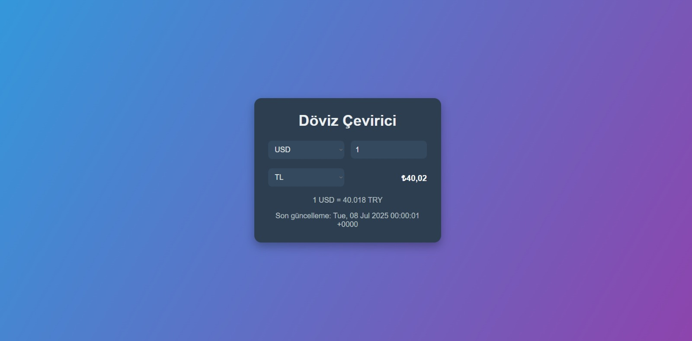

# 💱 Döviz Çevirici

Bu proje, kullanıcıların farklı para birimleri arasında anlık olarak dönüşüm yapmasını sağlayan basit ve modern bir döviz çevirici uygulamasıdır.

---

## 🚀 Özellikler

- Gerçek zamanlı döviz kuru verisi (ExchangeRate API)
- Temiz ve responsive tasarım
- Para birimi seçimi ve miktar girme
- Canlı sonuç gösterimi
- Son güncellenme tarihi bilgisi
- Kullanıcı dostu arayüz

---

## 🛠️ Kullanılan Teknolojiler

- **HTML**
- **CSS**
- **JavaScript (Vanilla JS)**
- [ExchangeRate API](https://www.exchangerate-api.com/) – Döviz verileri için

---

## 📷 Ekran Görüntüsü

> Ekran görüntüsü eklersen buraya aşağıdaki gibi koyabilirsin:

---